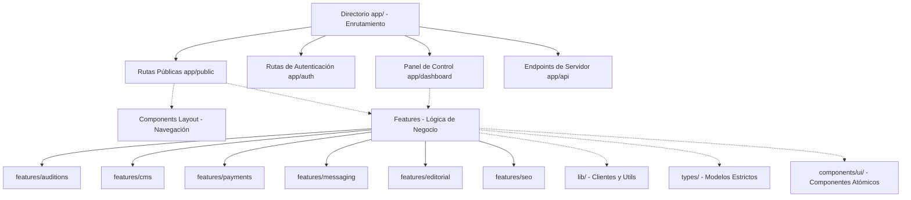

# Arquitectura de Software - DV Performing Arts

Este documento describe los principios de diseño y la estructura del sistema elegidos para la plataforma.

## 1. Patrón Arquitectónico Principal

La aplicación se construye sobre **Next.js** utilizando el **App Router**. Se implementa un diseño modular enfocado en la separación de responsabilidades y la modularidad por características (*Features*):

## 2. Organización del Código

### Rutas (`app/`)
- `app/(public)/`: Rutas visibles al usuario no autenticado (Home, Programas, Producciones, Blog).
- `app/(auth)/`: Rutas del sistema de autenticación (Login, Registro).
- `app/dashboard/`: Vistas de paneles privados estructurados por roles.
- `app/api/`: Endpoints dedicados para webhooks, colas y operaciones internas.

### Características (`features/`)
Para evitar el acoplamiento y facilitar el mantenimiento, cada módulo de negocio complejo se aísla en su respectivo directorio en `features/`. Cada módulo contiene sus propias validaciones, esquemas, sub-componentes especializados y helpers de API.
- **`features/auditions`:** Lógica de asignación de folios, registros y flujos de audición.
- **`features/cms`:** Bloques de contenido JSON y esquemas estructurados para edición.
- **`features/payments`:** Integración y comunicación con Stripe.
- **`features/messaging`:** Proveedores abstractos para notificaciones (Email & WhatsApp).
- **`features/editorial`:** Clientes y hooks para integrar el contenido de Manifiesto 21.
- **`features/seo`:** Helpers de Schema.org y metadatos adicionales.

### Componentes de Presentación (`components/`)
Divididos por jerarquía y reusabilidad:
- `components/ui/`: Presentación pura (botones, campos de texto, modales).
- `components/layout/`: Elementos estructurales del sitio (Header, Footer, Sidebar).
- `components/home/`: Bloques de interfaz exclusivos para la página de inicio.

### Biblioteca Compartida (`lib/`)
- `lib/db.ts`: Cliente de conexión global a base de datos (Prisma).
- `lib/utils.ts`: Utilidades comunes de combinación de clases CSS, formateo y validaciones genéricas.

---

## 3. Directrices de Implementación y Reglas de Desarrollo

### TypeScript Estricto
- Queda prohibido el uso de `any` en cualquier parte de la aplicación.
- Todos los retornos de funciones de servidor y APIs de Next.js deben estar tipados de manera explícita.
- Las llamadas a APIs externas deben validarse en tiempo de ejecución (ej. mediante esquemas de validación Zod o aserciones estrictas).

### Componentes de Servidor por Defecto (RSC)
- Todos los componentes en `app/` son **React Server Components** por defecto para maximizar el rendimiento y optimizar el SEO técnico.
- La directiva `"use client"` se agregará únicamente en componentes específicos que requieran interactividad del lado del navegador (ej. hooks de React, eventos `onClick`, manejo de estados locales en formularios).

### Lógica de Negocio Desacoplada
- Los componentes de interfaz de usuario (`components/ui`) deben ser de presentación pura. No deben realizar consultas a bases de datos ni llamadas a APIs directamente.
- Toda lógica de bases de datos, validación compleja y llamadas a servicios externos debe realizarse en Server Actions, API routes o controladores específicos ubicados en la carpeta `features/`.
