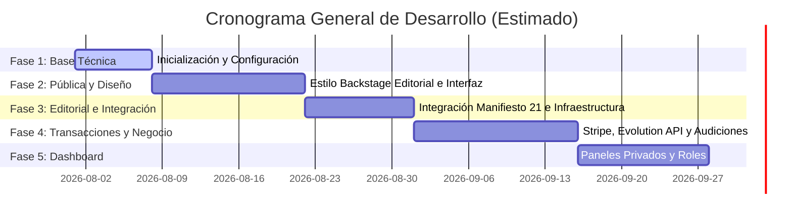

# Roadmap del Proyecto - DV Performing Arts

Este documento detalla el plan de hitos y entregas previstos para la reconstrucción de la plataforma.

---

## Detalle de Fases y Tareas

### Fase 1: Base Técnica (Completada)
- [x] Configuración inicial del entorno Next.js con TypeScript y Tailwind CSS.
- [x] Arquitectura de carpetas robusta y modular.
- [x] Modelado e interfaces de datos estrictas para todas las entidades.
- [x] Estrategia dinámica de indexación SEO por entorno.
- [x] Creación de documentación arquitectónica de referencia.

### Fase 2: Diseño Visual y Capa Frontend Pública
- [ ] Implementación de la identidad visual "Backstage Editorial".
- [ ] Maquetación responsiva y accesible de la página de inicio pública.
- [ ] Vistas de Catálogo de Programas y Clases de la academia.
- [ ] Vistas de Fichas de Maestros y Staff de Instructores.
- [ ] Cartelera de Obras y Producciones con fechas y detalles.
- [ ] Pruebas unitarias de componentes visuales principales.

### Fase 3: Motor Editorial y CMS de Bloques
- [ ] Integración con la API externa del motor editorial Manifiesto 21.
- [ ] Implementación de cacheado dinámico e invalidación bajo demanda.
- [ ] Diseño de la estructura interna del CMS de bloques controlados JSON.
- [ ] Desarrollo de la interfaz de edición y publicación de bloques para administradores.

### Fase 4: Core Transaccional (Audiciones, Pagos y WhatsApp)
- [ ] Configuración del ORM Prisma y la base de datos PostgreSQL.
- [ ] Formulario interactivo de audiciones con validación de datos en servidor (Zod).
- [ ] Generación de folios transaccionales seguros (secuencias de base de datos).
- [ ] Integración con Stripe Checkout y procesamiento de webhooks para cobros.
- [ ] Abstracción e integración del módulo de mensajería (Resend y Evolution API para WhatsApp).
- [ ] Implementación de cola asíncrona y sistema de reintentos para notificaciones de audición.

### Fase 5: Dashboard Privado y Pruebas Finales
- [ ] Configuración de NextAuth para inicio de sesión por roles (Administrador, Alumno, Maestro).
- [ ] Panel administrativo para gestión de folios de audición, alumnos y control escolar.
- [ ] Panel para alumnos (horarios, estatus de inscripción, pagos recurrentes).
- [ ] Bitácora de actividad de cambios administrativos en la plataforma.
- [ ] QA exhaustivo de flujos completos.
- [ ] Migración y apagado del sitio heredado en WordPress.
